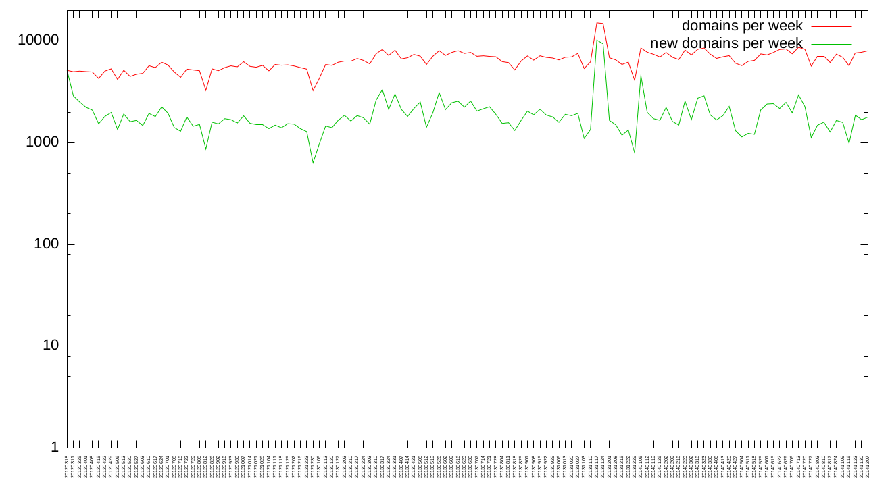
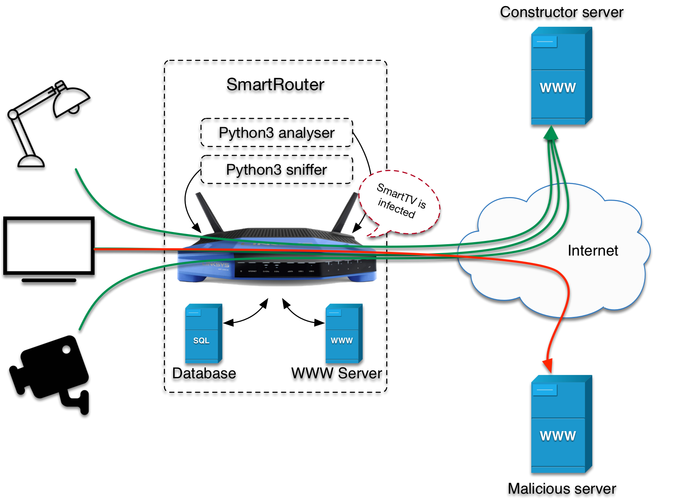

# Smart-Router

The number of Internet of Things (IoT) devices like smart TVs, smart lights and IP cameras used worldwide is currently exploding. These devices are all connected to the Internet and therefore represent potential targets for hackers. So how can we monitor these devices to be sure they only do the work they should. How to detect that an IoT device has been hacked and is now part of a botnet? 

## Goal

The goal of this project is to monitor the traffic generated by IoT devices in a SOHO (Small Office, Home Office) network. By capturing and analyzing this traffic, we can send alerts when an IoT has an unusual behavior, for example if it suddenly begins to send request to **new web domains**.

White listing web domains is usually inefficient for detecting compromised devices on a network. Indeed, devices like laptops, but also tablets and smartphones, are  used to surf the web, and a classical user regularly visits new websites. This is illustrated on the Figure below. It shows the number of web domains visited by the users of a medium sized network, and the number of new domains.

The Figure shows that each week, out of approximately 8000 visited domains, roughly 2000 (25\%) are new.

On the contrary, IoT devices should normally always connect to the same servers, namely the server of the manufacturer, which should allow to detect compromised devices.

## Architecture

The smart router is designed to be installed between the connected devices and the Internet, such that it can intercept and analyze the traffic generated by the devices. As presented on the Figure below, it is composed of three main modules:

* a traffic sniffer;
* a traffic analyzer and
* a web interface.

### Traffic sniffer

The traffic sniffer is a process that captures all SYN packets with destination port TCP/80 and TCP/443. This allows to detect all connection tentatives from the devices on the local network. For each tentative, following fields are stored in the database:

* source MAC address;
* destination IP address;
* timestamp.

To find the **web domain** that corresponds each destination IP, DNS packets are captured as well. 

Schematically, the process is the following :

* the IoT device sends a DNS query to the DNS server to get the IP address of *example.com*;
* the response from the DNS server is captured by the smart router. 
* the requested domain (*example.com*) and corresponding IP address (*1.2.3.4*) are stored in the database;
* the IoT device connects to *1.2.3.4*;
* the initial SYN packet sent by the device is captured by the smart router.

During the analysis step, the list of DNS responses is searched to find the domain corresponding to each IP address. If no domain is found, a reverse DNS lookup is execute.

### Traffic analyzer

The traffic analyzer process is regularly triggered to analyze captured traffic and determine if it is legit or malicious.

During the initial learning period, all connections performed by an IoT device are considered as legit. After this period, if an IoT contacts an new domain, the connection is considered as malicious. Is this case an alert is generated and stored in the database.

Moreover, additional modules may be triggered when an alert occurs, like a Slack notification (see below), a notification on a dedicated phone app, a webhook etc.

### Web interface

The web interface allows the user to configure the router, check its status and analyze the alerts.

## Implementation

To test the detection system, we built a complete implementation using OpenWRT, Python and Scapy.

### OpenWRT

The OpenWrt Project [https://openwrt.org](https://openwrt.org) is a Linux operating system targeting embedded devices. So it was one of the possible choices for the Linux distribution. More specifically, OpenWRT was a compatible distribution for the router used for this project. The routers used are Linksys WRT1200ac.

### Scapy

We used python and scapy [https://scapy.net](https://scapy.net) to implement the traffic sniffer and the traffic analyzer.  Scapy is a tool for manipulating network packets. It can forge or decode packets, send them on the wire, capture them, and match requests and replies.

### Web server

Due to portability issues and high resource consumption, we implemented a very simple web interface on the OpenWRT router: alerts are simply read on a text file and displayed vie a simple web server.

## Testing

We tested the smart router in different SoHo networks. To easily collect the alerts produced by the test routers, we implemented a Slack application that receives and displays the alerts from the different routers.

The results collected show that, indeed, after a short learning period, there are almost no new domains visited by the IoT devices.

## Future Work

The results collected so far are very encouraging and show that white listing is indeed an effective tool for detecting compromised IoT devices.

However, this project offers many opportunities for improvement like:

* analyzing other protocols beside DNS and HTTP;
* auto-detecting IoT devices such that the traffic sniffer and the traffic analyzer can focus on these devices, instead of analyzing all devices on the network; 
* improving the web interface and implement new alerting modules;
* using advanced machine learning and deep learning algorithms to detect compromised devices.
* perform a large scale test campaign.
