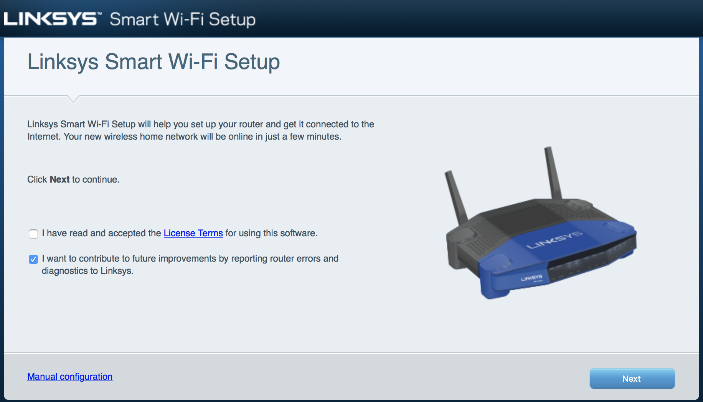
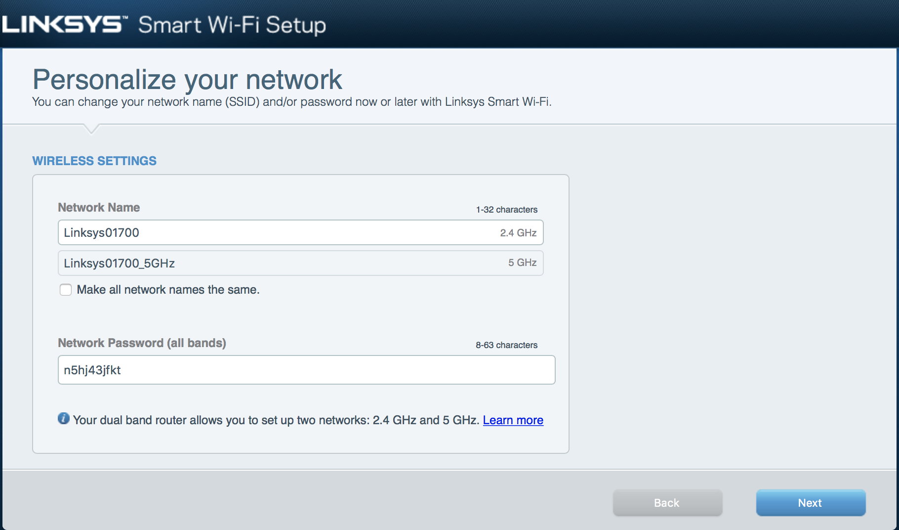
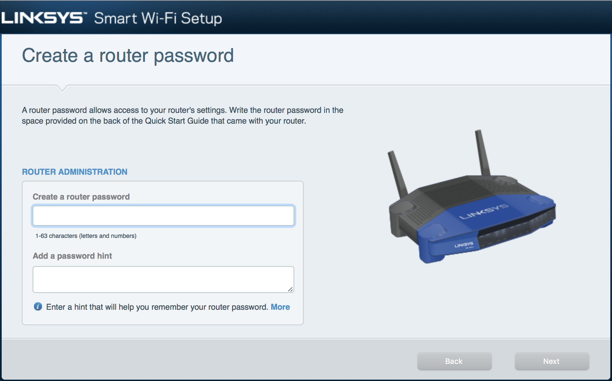
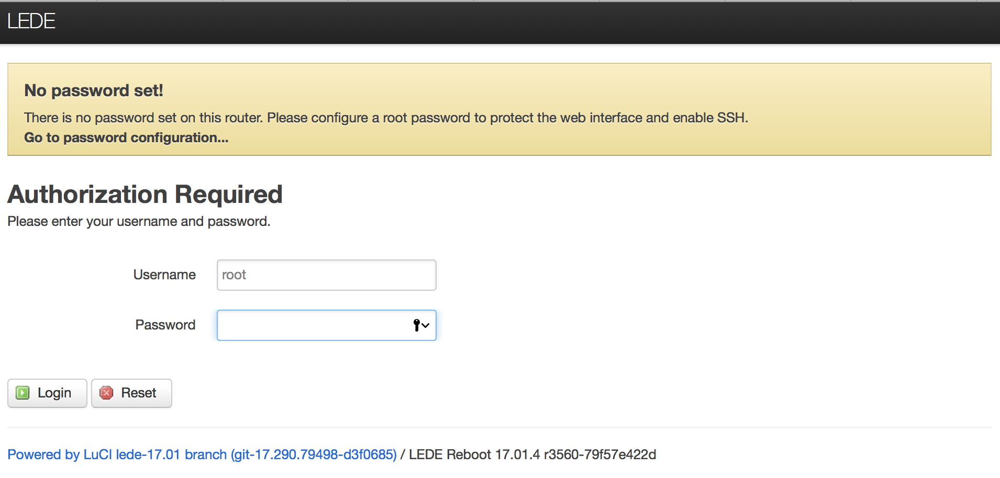
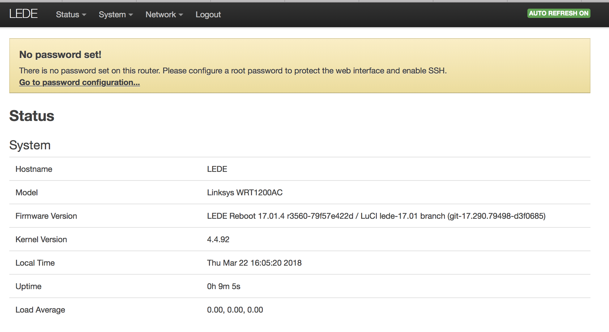
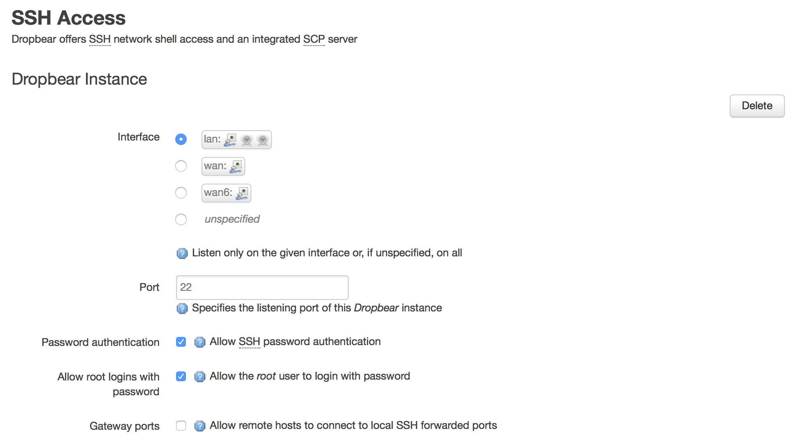
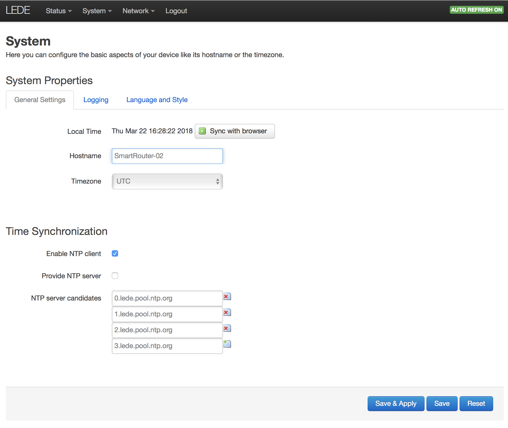
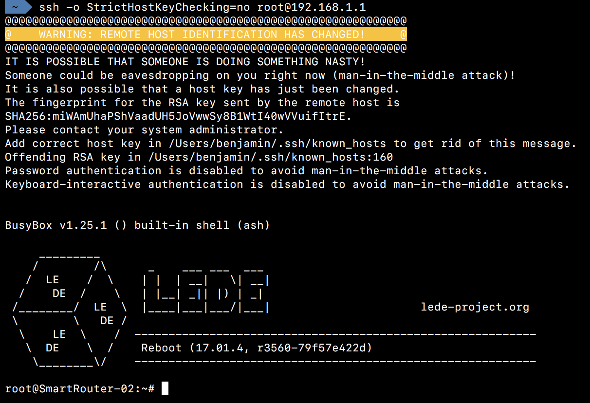

# Configure the smart router
## Install OpenWRT
### Join wireless network
First, we need to reset de router, he will then create a network with an SSID which can be found at the bottom of the router.
So we need to connect to the routeur with the IDs found at his bottom.

The router me have an internet connection for the next step, so we connect his wan interface to a switch or something like thind wich provide dhcp lease and internet connection.

### Connect to web interface
https://www.youtube.com/watch?v=YB0VL_YFn9M

* Once we are connected to the router network, we need to go at http://192.168.1.1.
We accept terms and click next and follow the wizard instructions.

* Once the router has rebooted, we reconnect to him and follow the next wizzard.

* We enter a password and a hint password for the router, but nothing of this has a real importance becasue we are going to replace the OS of the router.

* Once the wizzard finished, we arrived on the configuration interface of the router : 
* We then go to the "Connectivity" setting tab and select "Choose file" into the "Manual" section.

* We navigate trough to file "lede-17.01.4-mvebu-linksys-wrt1200ac-squashfs-factory.img" wich can be find on the docs/images folder on the smart-router github repository
* The router will than reboot and boot on OpenWRT
* The router will not broadcast an SSID be default so we ne to connect to him directly by cable (the router does not accept outside conenction by default so we need to plug te cable to a LAN interface).
* The router will take the address 192.168.1.1 by default so we can take the addresse 192.168.1.100 to connect to it and configure it

## Configure OpenWRT
* Next step is to configure OpenWRT, like seen on the last screenshot, the router has not any password by default, so we need to define one. 
* We then click on "Go to password configuration...", define a password and save the configuration (bottom of the page) 

* We now have to enable ssh on the router. So we enter password in password fileds (because if not done it take randoms password and save it (super idea OpenWRT really..)), and select "lan" interface between ssh section. If we want, we can had a ssh key to be able to log into the router without typing password.

* after enabling ssh we have to change to router hostname. For doing this we have to go to System->System, enter a new hostname and Save&Apply.

* It is now possible to ssh the router 

## Configure the SmartRouter settings
**For the next step, an USB stick formated on ext4(sudo mkfs.ext4 /dev/diskName) must be plugged into the smart-router and the routeur needs to have an internet connection**

### USB format 
In linux VM use gparted to create a msdos partion table then next create an ext4 partion of the full size of the USB.

