## Install OpenWRT on Linksys WRT1200AC

### Join wireless network
First, we need to reset the router, he will then create a network with an SSID which can be found at the bottom of the router.
So we need to connect to the router with the IDs found at his bottom. Or simply connect to in by plugging a network cable into it.

The router me have an internet connection for the next step, so we connect his wan interface to a switch or something like this which provide a dhcp lease and internet connection.

### Connect to web interface
https://www.youtube.com/watch?v=YB0VL_YFn9M

* Once we are connected to the router network, we need to go at http://192.168.1.1.
We accept the terms and click next and follow the wizard instructions.
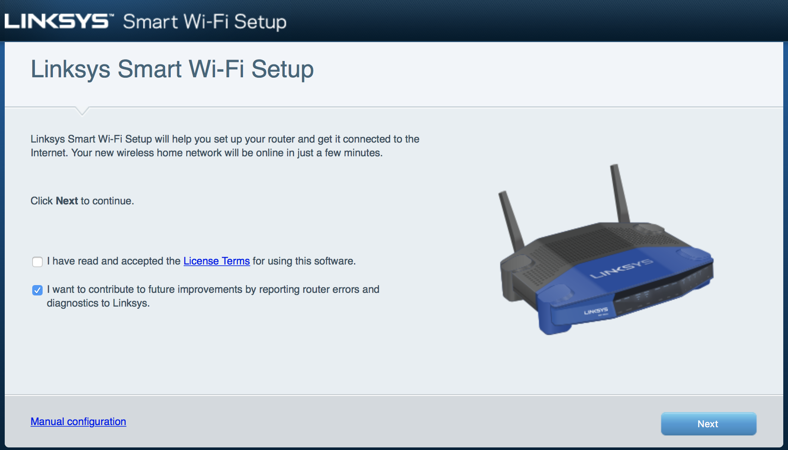
* Once the router has rebooted, we reconnect to him and follow the next wizard.
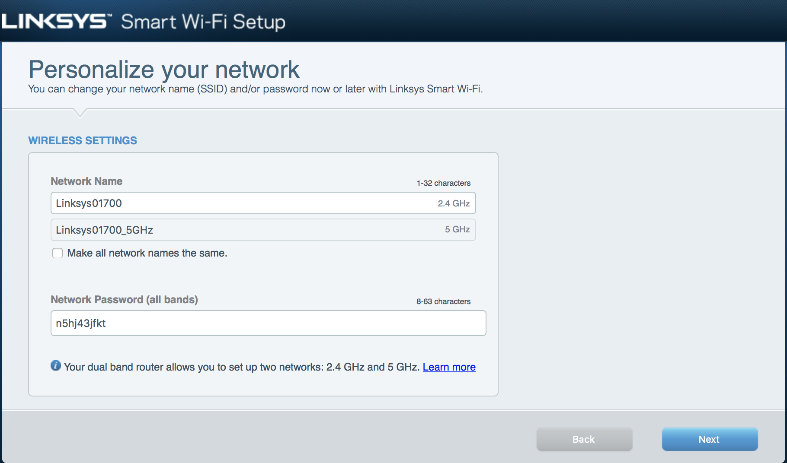
* We enter a password and a hint password for the router, but nothing of this has a real importance because we are going to replace the OS of the router.
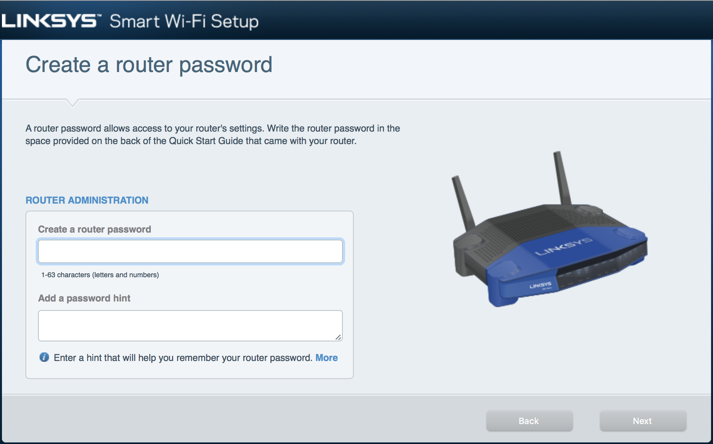
* Once the wizard finished, we arrived on the configuration interface of the router : 
* We then go to the "Connectivity" setting tab and select "Choose file" into the "Manual" section.
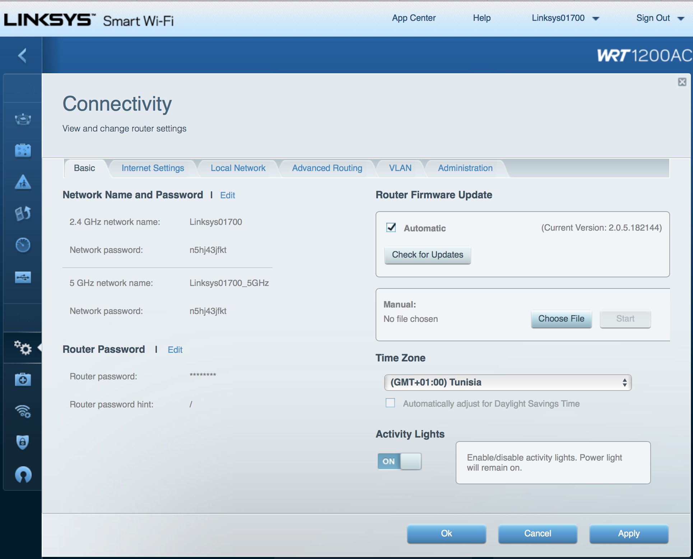
* We navigate trough to the file "openwrt-23.05.3-mvebu-cortexa9-linksys_wrt1200ac-squashfs-factory" which can be found on the docs/images folder on the smart-router github repository, then click on "start" button 
* The router will reboot and boot on OpenWRT
* The router will not broadcast an SSID by default, so we need to connect to him directly by cable (the router does not accept outside connection by default, so we need to plug the cable to a LAN interface).
* The router will take the address 192.168.1.1 by default, so we can take the address 192.168.1.5 if it does not distribute DHCP address to connect to it and configure it

## Configure OpenWRT
* Next step is to configure OpenWRT, like seen on the last screenshot, the router has not any password by default, so we need to define one. 
* We then click on "Go to password configuration...", define a password and save the configuration (bottom of the page) 
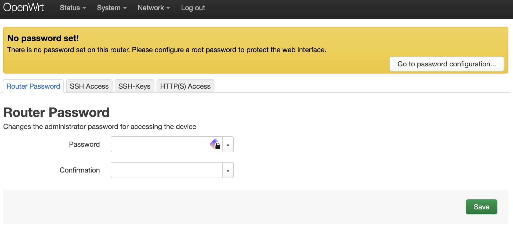

## Configure the SmartRouter settings
**For the next step, an USB stick formatted on ext4 (sudo mkfs.ext4 /dev/diskName) must be plugged into the smart-router and the router needs to have an internet connection**

### Format the usb for the OpenWRT config from a debian VM
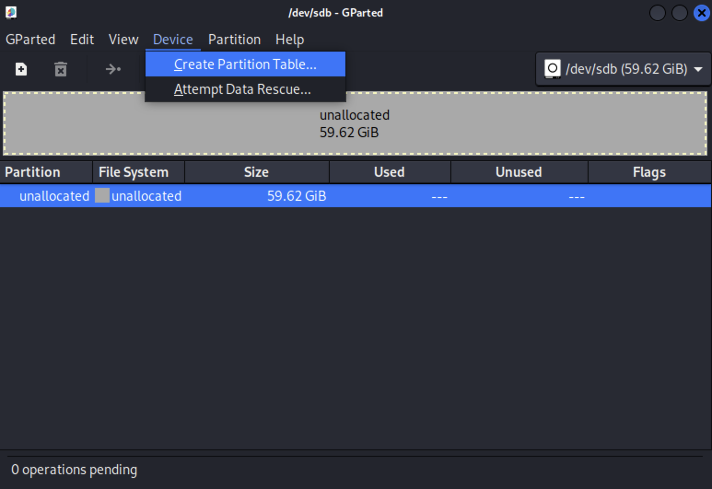
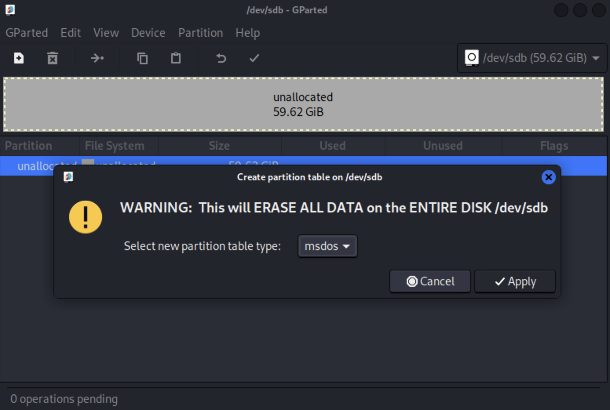
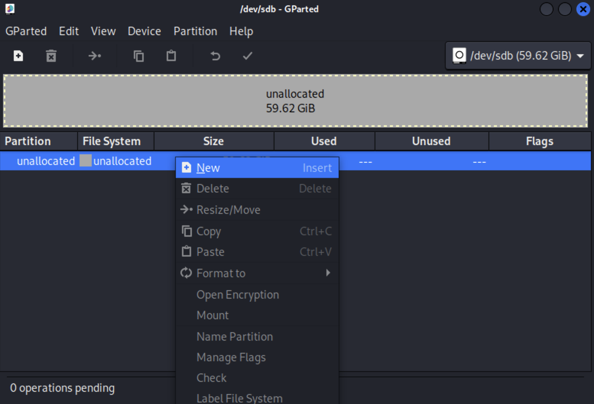
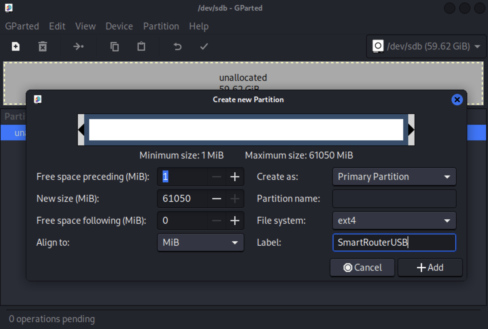
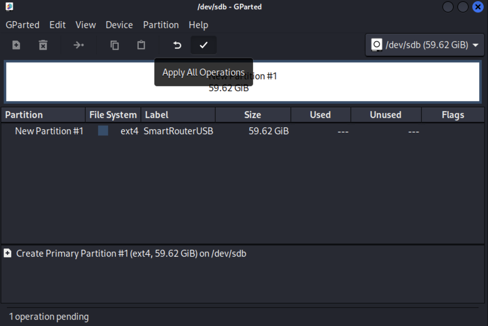

### USB format 
In linux VM (or something else that has gparted), use gparted to create a msdos partition table then next create an ext4 partition of the full size of the USB.
Once USB formatted and plugged into the router, run :

````
opkg update 
opkg install ca-bundle ca-certificates curl
sh -c "$(curl -fsSL https://raw.githubusercontent.com/RUCD/smart-router/master/docs/setupScripts/setupUSB.sh)"
````

Once done, reboot the router

You can check the correct previous configuration by doing : 
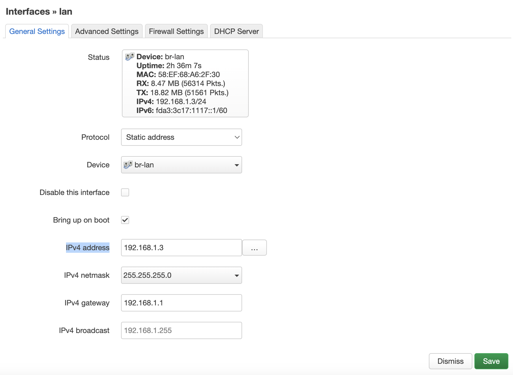


### Smart-router setup script
````
sh -c "$(curl -fsSL https://raw.githubusercontent.com/RUCD/smart-router/master/docs/setupScripts/setupSR.sh)"
````
**Check all output because the script does not exit if there is an error!**

If there are no errors during the script, the smart-router is ready ! 

You can now see alerts @ http://192.168.1.1:81/alerts.txt

### Wireless setup script
In case you want a default wireless setting with SSID like the router's hostname and pseudorandom password : 

````
sh -c "$(curl -fsSL https://raw.githubusercontent.com/RUCD/smart-router/master/docs/setupScripts/setupWireless.sh)"
````

### Uninstall
**Use this script at your own risks**

In case you want to uninstall all things installed, run : 

````
sh -c "$(curl -fsSL https://raw.githubusercontent.com/RUCD/smart-router/master/docs/setupScripts/uninstall.sh)"
````


If the script fails, run it a second time, must do the job.
